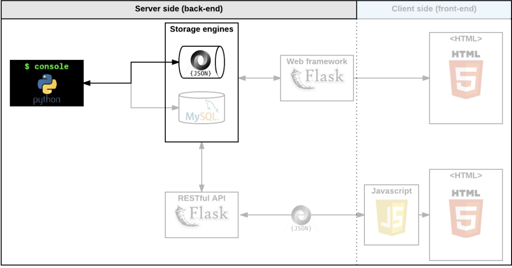
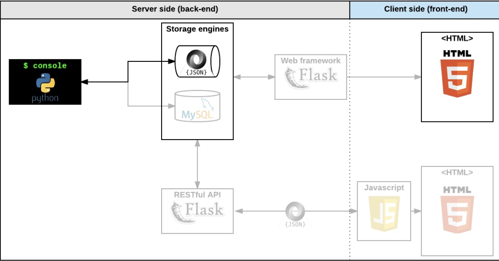

# AirBnB clone - The console
## First step: Write a command interpreter to manage your AirBnB objects.
This is the first step towards building your first full web application: the AirBnB clone. This first step is very important because you will use what you build during this project with all other following projects: HTML/CSS templating, database storage, API, front-end integration…

Each task is linked and will help you to:

* Put in place a parent class (called BaseModel) to take care of the initialization, serialization and deserialization of your future instances
* Create a simple flow of serialization/deserialization: Instance <-> Dictionary <-> JSON string <-> file
* Create all classes used for AirBnB (User, State, City, Place…) that inherit from BaseModel
* Create the first abstracted storage engine of the project: File storage.
* Create all unittests to validate all our classes and storage engine

### Task 0: README, AUTHORS
- **Files** `README.md`, `AUTHORS`

### Task 1: Be pycodestyle compliant!
- **Descrip** Write beautiful code that passes the pycodestyle checks.

### Task 2: Unittests
- **File** `tests/`
- **Descrip** All your files, classes, functions must be tested with unit tests

### Task 3: BaseModel
- **Files** `models/base_model.py`, `models/__init__.py`, `tests/`
- **Descrip** Write a class BaseModel that defines all common attributes/methods for other classes:

### Task 4: Create BaseModel from dictionary
- **Files** `models/base_model.py`, `tests/`
- **Descrip** Previously we created a method to generate a dictionary representation of an instance (method to_dict()). Now it’s time to re-create an instance with this dictionary representation.

### Task 5: Store first object
- **Files** `models/engine/file_storage.py`, `models/engine/__init__.py`, `models/__init__.py`, `models/base_model.py, tests/`
- **Descrip** Now we can recreate a BaseModel from another one by using a dictionary representation: It’s great but it’s still not persistent: every time you launch the program, you don’t restore all objects created before… The first way you will see here is to save these objects to a file.

* Writing the dictionary representation to a file won’t be relevant:
- * Python doesn’t know how to convert a string to a dictionary (easily)
- * It’s not human readable
- * Using this file with another program in Python or other language will be hard.

### Task 6: Console 0.0.1
- **File** `console.py`
- **Descrip** Write a program called console.py that contains the entry point of the command interpreter:

### Task 7: Console 0.1
- **File** `console.py`
- **Descrip** Update your command interpreter (console.py) to have these commands:

* `create`: Creates a new instance of BaseModel, saves it (to the JSON file) and prints the id. Ex: $ create BaseModel
* `show`: Prints the string representation of an instance based on the class name and id. Ex: $ show BaseModel 1234-1234-1234
* `destroy`: Deletes an instance based on the class name and id (save the change into the JSON file). Ex: $ destroy BaseModel 1234-1234-1234.
* `all`: Prints all string representation of all instances based or not on the class name. Ex: $ all BaseModel or $ all.
* `update`: Updates an instance based on the class name and id by adding or updating attribute (save the change into the JSON file). Ex: $ update BaseModel 1234-1234-1234 email "aibnb@mail.com".

### Task 8: First User
- **Files** `models/user.py`, `models/engine/``file_storage.py`, `console.py`, `tests/`
- **Descrip** Write a class User that inherits from BaseModel:

* `models/user.py`
* Public class attributes:
    * `email`: string - empty string
    * `password`: string - empty string
    * `first_name`: string - empty string
    * `last_name`: string - empty string

### Task 9: More classes!
- **Files** `console.py`, `models/engine/file_storage.py`, `tests/`
- **Descrip** Write all those classes that inherit from BaseModel:

* `State` (`models/state.py`):
    * Public class attributes:
        * name: string - empty string
* `City` (`models/city.py`):
    * Public class attributes:
        * `state_id`: string - empty string: it will be the State.id
        * `name`: string - empty string
* `Amenity` (`models/amenity.py`):
    * Public class attributes:
        * `state_id`: string - empty string: it will be the State.id
        * `name`: string - empty string
* `Place` (`models/place.py`):
    * Public class attributes:
        * `city_id`: string - empty string: it will be the City.id
        * `user_id`: string - empty string: it will be the User.id
        * `name`: string - empty string
        * `description`: string - empty string
        * `number_rooms`: integer - 0
        * `number_bathrooms`: integer - 0
        * `max_guest`: integer - 0
        * `price_by_night`: integer - 0
        * `latitude`: float - 0.0
        * `longitude`: float - 0.0
        * `amenity_ids`: list of string - empty list: it will be the list of Amenity.id later
* `Review` (`models/review.py`):
    * Public class attributes:
        * `place_id`: string - empty string: it will be the Place.id
        * `user_id`: string - empty string: it will be the User.id
        * `text`: string - empty string

### Task 10: All instances by class name
- **File:** `console.py`
- **Descrip:** Update your command interpreter (console.py) to retrieve the number of instances of a class: <class name>.count().

### Task 11: All instances by class name
- **File:** `console.py`
- **Descrip:** Update your command interpreter (console.py) to retrieve all instances of a class by using: <class name>.all().

### Task 12: Count instances
- **File:** `console.py`
- **Descrip:** Update your command interpreter (console.py) to retrieve the number of instances of a class: <class name>.count().

### Task 13: Show
- **File:** `console.py`
- **Descrip:** Update your command interpreter (console.py) to retrieve an instance based on its ID: <class name>.show(<id>).

### Task 14: Destroy
- **File:** `console.py`
- **Descrip:** Update your command interpreter (console.py) to destroy an instance based on his ID: <class name>.destroy(<id>).

### Task 15: Update
- **File:** `console.py`
- **Descrip:** Update your command interpreter (console.py) to update an instance based on his ID: <class name>.update(<id>, <attribute name>, <attribute value>).

### Task 16: Update from dictionary
- **File:** `console.py`
- **Descrip:** Update your command interpreter (console.py) to update an instance based on his ID with a dictionary: <class name>.update(<id>, <dictionary representation>).

### Task 17: Unittests for the Console!
- **File:** `tests/test_console.py`
- **Descrip:** Write all unittests for console.py, all features!

# 0x01. AirBnB clone - Web static
Now that you have a command interpreter for managing your AirBnB objects, it’s time to make them alive!

Before developing a big and complex web application, we will build the front end step-by-step.

The first step is to “design” / “sketch” / “prototype” each element:

Create simple HTML static pages
* Style guide
* Fake contents
* No Javascript
* No data loaded from anything

### Task 0: Inline styling
- **File:** `0-index.html`
- **Descrip:** Write an HTML page that displays a header and a footer.

### Task 1: Head styling
- **File:** `1-index.html`
- **Descrip:** Write an HTML page that displays a header and a footer by using the style tag in the head tag (same as `0-index.html`)

### Task 2: CSS files
- **Files:** `2-index.html`, `styles/2-common.css`, `styles/2-header.css`, `styles/2-footer.css`
- **Descrip:** Write an HTML page that displays a header and a footer by using CSS files (same as 1-index.html)

### Task 3: Zoning done!
 - **Files:** `3-index.html`, `styles/3-common.css`, `styles/3-header.css`, `styles/3-footer.css, images`
 - **Descrip:** Write an HTML page that displays a header and footer by using CSS files (same as 2-index.html)

### Task 4: Search!
 - **Files:** `4-index.html`, `styles/4-common.css`, `styles/3-header.css`, `styles/3-footer.css,`, `styles/4-filters.css`, `images/`
- **Descrip:** Write an HTML page that displays a header, footer and a filters box with a search button.

### Task 5: More filters
 - **Files:** `5-index.html`, `styles/4-common.css`, `styles/3-header.css`, `styles/3-footer.css`, `styles/5-filters.css`, `images/`
- **Descrip:** Write an HTML page that displays a header, footer and a filters box.

### Task 6: It's (h)over
 - **Files:** `6-index.html`, `styles/4-common.css`, `styles/3-header.css`, `styles/3-footer.css`, `styles/6-filters.css`, `images/`
- **Descrip:** Write an HTML page that displays a header, footer and a filters box with dropdown.

 ### Task 7: Display results
 - **Files:** `7-index.html`, `styles/4-common.css`, `styles/3-header.css`, `styles/3-footer.css`, `styles/6-filters.css`, `styles/7-places.css`, `images/`
- **Descrip:** Write an HTML page that displays a header, footer, a filters box with dropdown and results.

### Task 8: More details
 - **Files:** `8-index.html`, `styles/4-common.css`, `styles/3-header.css`, `styles/3-footer.css`, `styles/6-filters.css`, `styles/8-places.css`, `images/`
 - **Descrip:** Write an HTML page that displays a header, a footer, a filter box (dropdown list) and the result of the search.
